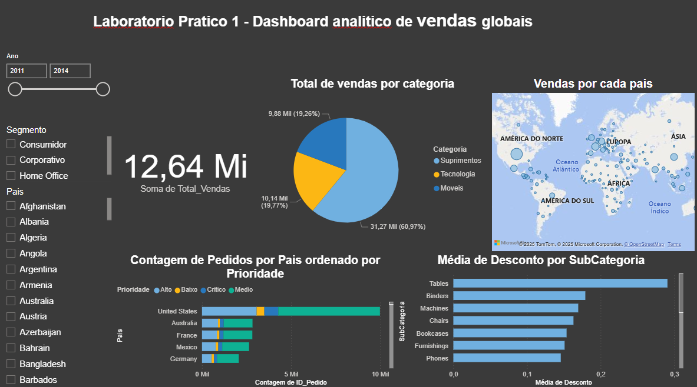

# Project 1: Global Sales Analytical Dashboard

## Description
This project develops an interactive dashboard for analyzing international sales,

with filters by region, product, and period. It uses the file `dataset.csv` data import,

visualizations such as maps and stacked bar charts.

## How to Execute
1. Open the `Project1.pbix` file in Power BI Desktop.
2. Update data connections if necessary.
3. Explore KPIs and drill down by continent.

## Files
- `Project1.pbix`: Power BI report.
- `dataset.csv`: Original dataset.
- `Global_Sales_analisys.png`: Dashboard image.

## Lessons Learned
- Relational modeling is essential for relating tables.
- Using slicers improves interactivity.

