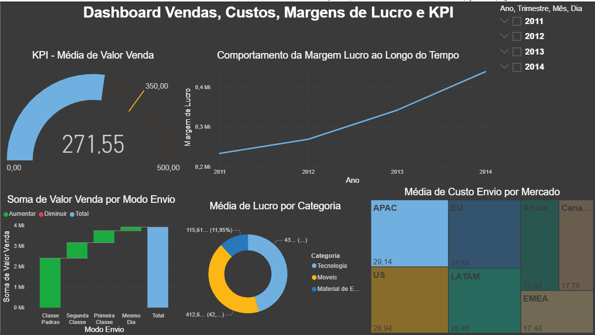

# Project 2: Global Sales Analytical Dashboard

## Description

This project develops an interactive dashboard for analyzing international sales, 
with filters by region, product, and period. It uses 4 CSV data imports 
(Clients.csv, Pedidos.csv, Produtos.csv, and Vendas.csv ), creation of DAX measures 
for totals and YoY (Year-over-Year) growth, and visualizations such as maps and stacked bar charts.
How to Execute

Open the Lab.2.0.pbix file in Power BI Desktop.
Update data connections if necessary.
Explore KPIs and drill down by continent.

### Files

Power BI report: Lab.2.0.pbix.

Original datasets: Clients.csv, Pedidos.csv, Produtos.csv, and Vendas.csv.

Dashboard image: Margens_de_Lucro_KPI.png:

### Lessons Learned

Relational modeling is essential for connecting tables.
Using slicers improves interactivity.

